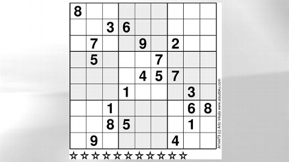

# Sudoku Solver

Yet another sudoku solver implemented using Python

The algorithm used here was invented by me, so I'm not sure it could solve every case yet. If you find cases where it fails, I'd be interested to know.

The current algorithm was able to solve the so-called [world's hardest sudoku by Finnish mathematician Arto Inkala](https://abcnews.go.com/blogs/headlines/2012/06/can-you-solve-the-hardest-ever-sudoku).

